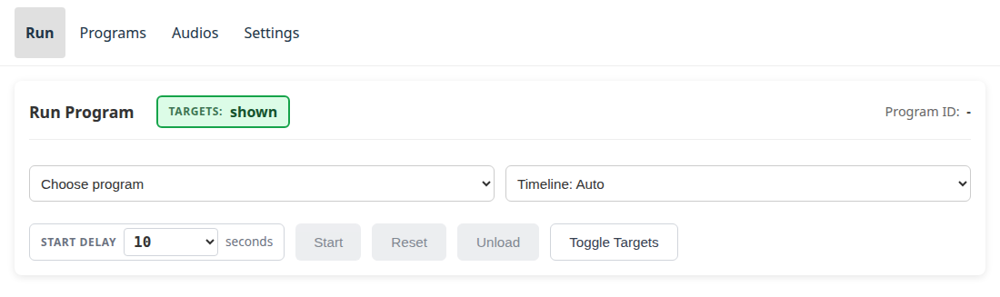

# Ansluta

Kortet serverar sin egen webbapp — det finns inget att installera. Men du kan
bara öppna den när enheten är **på ett nätverk som du också är på**, så det
kommer först.

## Börja med statuslampan { #start-with-the-led }

[Statuslampan](status-led.md) talar om vilken av två situationer du befinner
dig i, innan du provar någon adress:

| Lampa | Situation | Gå till |
|---|---|---|
| **Grön** | På ett nätverk och serverar | [Hitta enheten](#finding-the-device) |
| **Blinkande röd** | Försöker fortfarande ansluta | Vänta — den blinkar en gång per försök, ungefär var 2,4 s |
| **Blå** | Har gett upp och erbjuder nu sitt eget nätverk | [Installationsportalen](#the-setup-portal) |
| **Fast röd** | Slut på försök och erbjuder inget nätverk heller | Se [Felsökning](troubleshooting.md) |

En enhet som aldrig har konfigurerats, eller som har flyttats till en plats
vars WiFi den inte känner till, startar **blå**. Det finns ingen adress att
hitta ännu — nätverket den ska ansluta till finns inte, sett från dess sida.

## Installationsportalen { #the-setup-portal }

En **blå** lampa betyder att enheten kör en liten egen accesspunkt. Namnet
följer mönstret `revolve-now-setup-XXXX`, där `XXXX` är unikt för just den
enheten, så att två kort på samma plats går att skilja åt.

Anslut till det nätverket från en telefon eller surfplatta. Det är normalt
lösenordsskyddat — fråga den som satte upp enheten om du inte blir ombedd att
ange något. När du väl är ansluten bör en portalsida öppnas av sig själv; om
den inte gör det, surfa till `http://192.168.4.1`.


Ange nätverksnamnet och lösenordet som enheten ska använda.

!!! important "Tryck på knappen på enheten innan du sparar"

    Enheten tar inte emot några nätverksuppgifter förrän någon trycker på dess
    **BOOT**-knapp — den lilla knappen bredvid USB-uttagen, märkt `BOOT` eller
    `FLASH` på vissa kort. Tryck på den, och tryck sedan på **Save and
    restart**.

    Om du sparar utan att trycka på den först säger sidan det, och ingenting
    lagras; tryck på knappen och spara igen.

    **Varför:** installationsnätverkets lösenord är detsamma på alla enheter
    och projektets källkod är öppen, så att vara *på* det nätverket bevisar
    inte mycket. Knapptrycket bevisar att någon står vid enheten — vilket är
    precis det som inte går att göra från en parkeringsplats. Utan det skulle
    vem som helst inom radioräckvidd från en enhet som tappat sitt nätverk
    kunna peka den mot ett nätverk de själva väljer.

    Trycket gäller i ungefär en minut, så det är ingen brådska, och ett tryck
    som ingen minns att de gjort kan inte godkänna något senare.

När uppgifterna sparats startar enheten om och ansluter till det nätverket på
vanligt sätt — lampan blir blinkande röd, sedan grön.

Därifrån är den på ditt nätverk, och resten av den här sidan gäller.

## Flytta enheten till ett annat nätverk { #moving-the-device-to-a-different-network }

Om enheten inte längre når det nätverk den känner till — klubben bytte WiFi,
eller kortet har tagits någon annanstans — ger den upp efter ungefär tio
sekunder och startar installationsportalen av sig själv. Inget att göra: vänta
på **blå** och [konfigurera den därifrån](#the-setup-portal).

Det andra fallet är: **nätverket den känner till finns fortfarande, och du vill
ändå ha den på ett annat.** Enheten ansluter glatt till vårt och erbjuder aldrig
portalen, så det finns inget att konfigurera den genom.

Använd då [Expertläge](expert-mode.md#wifi) — tryck på enhetens BOOT-knapp tre
gånger inom tio sekunder, så visar webbappen samma formulär som
installationsportalen gör. Att spara lagrar nätverket; enheten går över till
det när du trycker på [**Starta om för att
verkställa**](expert-mode.md#restart-to-apply), och behåller allt annat: sina
program, sina ljudklipp och sina hårdvaruinställningar.

**Tiosekundersgreppet nedan är den större hammaren**, och behövs numera bara
när ett kort ska lämnas över till en annan klubb, eller när ett kort måste
glömma nätverket som är inbyggt i dess firmware. Det kastar bort mer än
nätverket.

För att göra det, **håll BOOT-knappen intryckt i tio sekunder**.

| Medan du håller | Lampa | Betydelse |
|---|---|---|
| 0–3 sekunder | oförändrad | Inget har hänt ännu |
| efter 3 sekunder | **vit** | Den räknar. Släpp nu så ändras ingenting |
| efter 10 sekunder | startar om | Klart |

Den kommer tillbaka **blå** och erbjuder sin installationsportal, precis som
ett kort som aldrig har konfigurerats.

!!! warning "Vad ett tiosekundersgrepp raderar"

    - **Alla nätverk den känner till**, inklusive det som är inbyggt i dess
      firmware — vilket är poängen, annars skulle den helt enkelt ansluta till
      vårt igen.
    - **Dess hårdvaruinställningar**: stiftnummer, värdnamn och visningsnamn går
      tillbaka till standardvärdena, så den svarar på `revolve-now.local` igen.

    **Dina program och ljudklipp behålls.** Allt som laddats upp till enheten
    stannar på den, även vid ägarbyte — det är en annan sak än vilket nätverk
    den är på, och det kan vara den enda kopian.

Om du har en USB-kabel och en seriell terminal gör `factory-reset` i enhetens
konsol samma sak, och talar först om vad den tänker göra.

## Hitta enheten { #finding-the-device }

Anslut till samma WiFi som enheten är på, och öppna sedan dess adress.

Den annonserar sig själv över mDNS, så på de flesta telefoner, surfplattor och
bärbara datorer är adressen bara dess värdnamn:

```
http://revolve-now.local
```

!!! note "Hette tidigare `rotation-target.local`"

    Systemet hette Rotation Target innan det blev Revolve Now. En enhet som
    fortfarande kör firmware från den tiden svarar på
    `http://rotation-target.local`, och dess installationsnätverk heter
    `rotation-target-setup-XXXX`. Den byter till det nya namnet vid nästa
    firmware-uppdatering, om inte någon har gett den ett eget värdnamn i
    Expertläge.

Om det namnet inte går att slå upp — vissa routrar och de flesta gästnätverk
blockerar mDNS — leta i stället reda på enhetens IP-adress, till exempel i
routerns klientlista, och öppna `http://<den adressen>` direkt. Adressen visas
också på appens egen sida Inställningar, bredvid serveradressen, vilket är det
enklaste sättet att läsa upp den för någon annan när du väl är inne.

Appen öppnas på sidan Kör:



## Redigera program utan enhet { #editing-programs-without-a-device }

Program kan också skrivas på en bärbar dator utan något kort inblandat alls,
med [programredigeraren på webben](https://malmo-skyttegille-pistolsektionen.github.io/revolve_now/editor/)
— se [Skriva ett eget program](writing-a-program.md).
