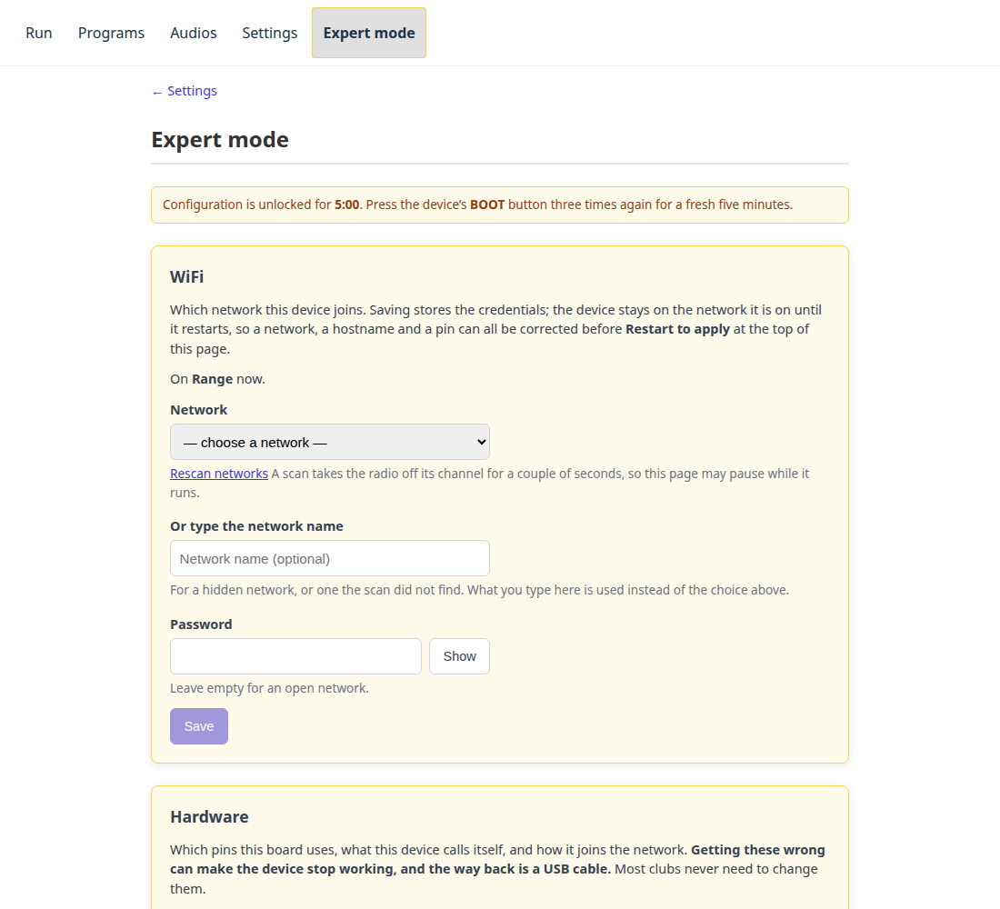

# Expertläge

Allt som kan få enheten att sluta fungera finns här, och ingenting annat.

De flesta klubbar öppnar aldrig den här sidan. Inställningarna på den är de som
görs en gång, när ett kort först sätts ihop eller flyttas någon annanstans —
och att få en av dem fel ger ingen varning, det ger en enhet som inte längre
svarar.

## Komma in { #getting-in }

**Tryck på BOOT-knappen på enheten tre gånger inom tio sekunder.** Den sitter
intill USB-uttagen och kan vara märkt `FLASH`. En flik **Expertläge** dyker upp
i webbappen och stannar i fem minuter; tryck tre gånger igen för fem nya.

Tre tryck i stället för ett så att det inte kan hända av misstag, och en knapp
i stället för ett lösenord eftersom det som ska fastställas är att **någon
står vid enheten**. Det är inget någon kan göra från andra sidan skjutbanan,
på något avstånd, med någon behörighet — vilket är hela poängen.

!!! note "Det öppnar inte under en körning"

    Ett program som kör håller fönstret stängt. Att konfigurera om maskinen
    och att använda den är olika jobb, och de här inställningarna börjar ändå
    inte gälla förrän enheten startar om. Stoppa körningen först.

Om fliken inte finns där har ingen tryckt på knappen nyligen. Om den försvinner
medan du skriver tog de fem minuterna slut — tryck tre gånger igen och
fortsätt.

## Starta om för att verkställa { #restart-to-apply }

**Ingenting på den här sidan börjar gälla förrän enheten startar om**, och
ingenting på den startar om enheten av sig självt. Varje avsnitt har en vanlig
**Spara**, som lagrar ändringen; enheten fortsätter göra det den höll på med.

**Starta om för att verkställa** visas intill rubriken *Expertläge* närhelst
enheten håller en inställning den ännu inte kör med, och att verkställa allt är
ett tryck på den. Så ett stift, värdnamnet och nätverket kan alla rättas i
samma sittning, och enheten går ner en gång i stället för tre.

!!! note "Sidan tappar kontakten medan enheten startar om"

    Några sekunder, ladda sedan om. Om en nätverksändring var bland det du
    sparade, ladda om på enhetens namn på det *nya* nätverket — och om den inte
    kan gå med i det reser den sitt eget installationsnätverk (`…-setup-XXXX`)
    och väntar där, vilket är [vägen tillbaka](connecting.md#the-setup-portal)
    och inte ett fel.

Knappen finns kvar efter att femminutersfönstret löpt ut, men inte avsnitten:
det fönstret tillåter är *ändringen*, och den här verkställer bara en som
redan är gjord. **Inställningar** säger samma sak på en rad, så den som inte
gjorde ändringen får ändå reda på den.

Den startar inte om under en körning. Stoppa programmet först.

## WiFi { #wifi }

Vilket nätverk enheten går med i. Samma formulär som
[installationsportalen](connecting.md#the-setup-portal), eftersom det är samma
jobb: välj ett nätverk i listan, eller skriv namnet på ett som sökningen inte
hittade, och ange lösenordet.

**Det här är svaret på "nätverket den känner till finns fortfarande, men jag
vill ha den någon annanstans."** Innan det här fanns var enda sättet att radera
allt enheten visste och låta den falla tillbaka till installationsportalen — se
[flytta enheten](connecting.md#moving-the-device-to-a-different-network), som
fortfarande är vägen när kortet inte når *något* nätverk det känner till.

**Spara** lagrar nätverket och inget mer: enheten stannar på nätverket den här
sidan serveras över, så ett misstag här går fortfarande att rätta från sidan
som gjorde det. Den flyttar när du trycker på **Starta om för att verkställa**,
och det är där varningen ovan om att tappa kontakten gäller.

Inget du har laddat upp påverkas. Program och klipp är en sak för sig, skild
från vilket nätverk enheten är på.

**Sök igen** gör en ny sökning. Den tar ett par sekunder, under vilka
enhetens radio är borta från sin egen kanal, så sidan kan hänga sig en stund —
det är sökningen, inte ett fel.

**För ett dolt nätverk**, låt listan vara och skriv namnet. Ett dolt nätverk
dyker aldrig upp i en sökning, så listan kan inte erbjuda det.

## Hårdvara { #hardware }

Vilka stift det här kortet använder, vad det kallar sig och hur det går med i
nätverket. Fel värden här är de vars väg tillbaka är en USB-kabel:

- Ett **fel stift** driver ingenting, och ett av stiften enheten vägrar skulle
  hindra den från att starta alls — vilket är varför den vägrar dem.
- Ett **fel värdnamn** ändrar namnet enheten svarar på, så webbappen slutar gå
  att nå på `revolve-now.local`. Värre än ett fel stift, som åtminstone lämnar
  appen uppe att rätta det från.

**Ingenting här börjar gälla förrän enheten startar om**, och sidan säger det
när ett sparat värde ännu inte används — då **Starta om för att verkställa**
högst upp på sidan. En ändring som verkar inte ha gjort något är så någon
slutar med att flasha om en fungerande enhet.

### Tavelgrupperna { #the-target-banks }

**Tavlor** är en tabell, en rad per [tavelgrupp](hardware.md#target-banks) — en
styrledning var, med bokstav efter position:

| Kolumn | Vad det är |
|---|---|
| **Tavelgrupp** | Bokstaven, A först. Den är radens position, inte ett lagrat värde, så att ta bort en grupp ger de efterföljande nya bokstäver |
| **Namn** | Vad operatörerna ser på Kör-sidan — `Vänster`, `Bana 3`. Bara för visning, högst 16 tecken, och får lämnas tomt |
| **GPIO** | Stiftet den här gruppens transistor är kopplad till. Varje grupp behöver ett eget, skilt från lampans och ljudstiften |
| **Visad vid låg nivå** | Om låg nivå visar *den här* gruppen. Per grupp, eftersom viloläget som måste vara säkert är en egenskap hos den gruppens inkoppling |
| **Stiftet nu** | Nivån som faktiskt ligger på stiftet, avläst i stället för ihågkommen. Den svarar på "driver firmwaren det här" utan multimeter |

**Lägg till tavelgrupp B** lägger till nästa bokstav, upp till åtta — det
mesta den här firmwaren driver. En ny rad börjar **utan GPIO**; Spara väntar
tills varje rad har ett, eftersom GPIO 0 är ett stift enheten vägrar och en rad
inte kan lämnas med ett värde som skulle komma tillbaka som ett fel.

Bara den **sista** tavelgruppen kan tas bort, och **grupp A aldrig**: bokstaven
är positionen, så att ta bort B på en enhet med fyra grupper skulle i tysthet
rikta om C och D mot fel banor. Ta bort dem från slutet och lägg till dem igen.

En rad vars värden skiljer sig från de kompilerade standardvärdena märks
**ändrad**, på samma sätt som varje annan inställning på den här sidan, så att
**Återställ till standard** säger vad den skulle ångra.

En grupp du lägger till är bara konfiguration; ledningen måste fortfarande
kopplas in, och enheten tar till sig det nya antalet när den startar om.

**Var tavlorna vilar vid uppstart** visas men går inte att redigera, och det är
**en inställning för alla grupper**. Vilket läge som är säkert i vila är en
egenskap hos tavelanläggningen, så det måste gå att ställa in — men det är
också det som skyddar någon som står framför skjutlinjen när ett kort
strömsätts, så det ändras bara från seriekonsolen med en kabel ansluten.

## Felsökning { #troubleshooting }

En zip-fil med enhetens egna uppgifter och, om den har kraschat, kraschdumpen —
det man bifogar i ett meddelande när ett kort kommit tillbaka från en skjutdag
och beter sig konstigt.

!!! warning "En kraschdump kan innehålla WiFi-lösenordet"

    Den är en kopia av enhetens minne i det ögonblick den gick sönder. Skicka
    den till någon du skulle berätta lösenordet för.

Det är därför den ligger bakom knapptrycket, och den ligger *bara* bakom
knapptrycket: [kontrollåset](settings.md#control-lock) hindrar den inte. Att
samla in en felrapport är en läsning, det stör ingen, och den som mest troligt
vill ha en under en tävling är den som inte kör.

[Skicka en felrapport](troubleshooting.md#sending-a-fault-report) har stegen.
