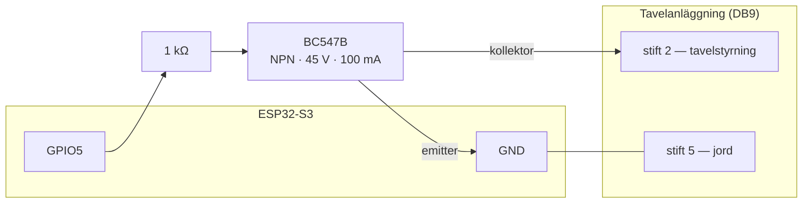

# Hårdvara och inkoppling

Så här måste en tavelanläggning vara beskaffad, elektriskt, innan ett kort kan
styra den — det en klubbmedlem som sätter upp en andra enhet behöver innan
något annat på den här webbplatsen är till nytta.

## Gränssnittet: en enda krets { #the-interface-one-circuit }

Kortet talar inget tavelsystems eget protokoll. Det sluter och bryter **en
enda krets**, över en DB9-kontakt, och tavelanläggningens egen elektronik
sköter resten.

| DB9-stift | Funktion |
|---|---|
| 2 | Tavelstyrning — kortsluts mot jord för att manövrera tavelanläggningen |
| 5 | Jord — den gemensamma returen för stift 2 |

Elektriskt sluter kortet inte den kretsen självt — ett GPIO-stift levererar
bara några tiotal milliampere och bör inte möta tavelanläggningens spänning
direkt. En transistor sköter brytningen i stället:

Ett GPIO-stift driver ett 1 kΩ-motstånd in i basen på en **BC547B**
NPN-transistor, som sköter själva brytningen. Transistorn är märkt för
**45 V och 100 mA** och ger ingen galvanisk isolation. Allt en tavelanläggning
kräver utöver de gränserna — en signal på nätspänningsnivå, eller en induktiv
last som en reläspole — behöver ett eget relä eller en egen optokopplare
mellan DB9-kontakten och lasten; det kan inte kopplas direkt till stift 2.

## Vad en tavelanläggning måste klara för att fungera { #what-a-target-system-has-to-do-to-work }

Inget i firmwaren är specifikt för någon enskild tavelanläggning — den byggdes
mot [Eigenbrod TP2](https://eigenbrod-schiessanlagen.de/en/products?tx_produkt_produkte%5Baction%5D=show&tx_produkt_produkte%5BL%5D=2&tx_produkt_produkte%5Bprodukt%5D=319&cHash=942340d5971be0a0ac3d26ff3c257c0b), men allt som
styrs på samma sätt bör fungera.

| Krav | Varför |
|---|---|
| Manövreras av en **kontaktslutning** — två anslutningar som kortsluts mot varandra | Det är hela gränssnittet. En anläggning som väntar sig ett seriellt protokoll, en egen buss eller en nätspänningssignal behöver hårdvara emellan |
| Vara **nivåstyrd**, inte pulsstyrd | Firmwaren håller linjen i ett läge under hela händelsen. En anläggning som växlar vid varje puls skulle röra sig på båda flankerna |
| Ha **två lägen** — framvänd och bortvänd | Programmens ordförråd är visa och dölj. Det finns ingen mellanvinkel att kommendera |
| Ta **en styrlinje per grupp av tavlor som ska röra sig tillsammans** | Varje linje är en *tavelgrupp*. En tavelgrupp är en kontaktslutning och rör sig som en; en enhet styr upp till åtta |
| Vara säker **framvänd** utan ström | Tavlorna vilar framvända och stannar så vid uppstart, med avsikt: någon kan befinna sig framför skjutlinjen när ett kort strömsätts, och en tavla som vänds av sig själv kan skada den personen |

## Tavelgrupper { #target-banks }

En **tavelgrupp** är en styrlinje: ett GPIO-stift, en transistor, en DB9-krets,
som flyttar alla tavlor som är kopplade till den tillsammans. En enhet styr
mellan en och åtta av dem, bokstaverade efter position — **A, B, C…** — och A
är den som diagrammet ovan visar. En klubb med en enda rad tavlor har
tavelgrupp A och inget mer, vilket är vad varje enhet som hittills levererats
är.

Tavelgrupper finns för att en skjutbana ska kunna exponeras en bana i taget:
tre banor på tre tavelgrupper kan visas en efter en från ett enda program, där
en enda linje bara kan vända alla tre på en gång.

Varje tavelgrupp är separat hårdvara. Den behöver **ett eget GPIO-stift** och
en egen transistor, och den har **sin egen polaritet** — om det är en låg nivå
som visar den — eftersom viloläget som måste vara säkert är en egenskap hos
den gruppens inkoppling, inte hos enheten. Att lägga till en är därför lödning
först och konfiguration sedan: koppla linjen, lägg sedan till tavelgruppen i
[Expertläge](expert-mode.md) med stiftet du kopplade den till, ett namn som de
som sköter enheten känner igen (`Vänster`, `Bana 3`) och den polaritet som
låter den vila där den ska. Enheten tar en ny tavelgrupp i bruk vid nästa
omstart.

Var tavlorna vilar vid uppstart är **en inställning för alla tavelgrupper**,
som bara ändras på seriekonsolen: den skyddar den som står framför
skjutlinjen, och det är ingen fråga per tavelgrupp.

Vilken nivå som visar tavlorna, och resten av stifttilldelningen, är numera en
konfigurationsinställning snarare än en bygginställning — men den bestäms
fortfarande när en enhet sätts upp, inte inför varje skjutdag. Fullständiga
inkopplingsdetaljer, inklusive vilka kort som stöds och deras
`menuconfig`-alternativ, finns i
[`firmware/docs/HARDWARE.md`](https://github.com/Malmo-Skyttegille-Pistolsektionen/revolve_now/blob/main/firmware/docs/HARDWARE.md)
i repot.

**Valfri kringutrustning**, som var för sig kan stängas av vid byggtillfället:
ljud-DAC:en som spelar upp eldkommandona, och [statuslampan](status-led.md).
En tavla som bara vänds, utan ljud, är en konfiguration som stöds.

<!-- TODO: ett fotografi av DB9-kontakten och transistorn så som de faktiskt är kopplade -->
