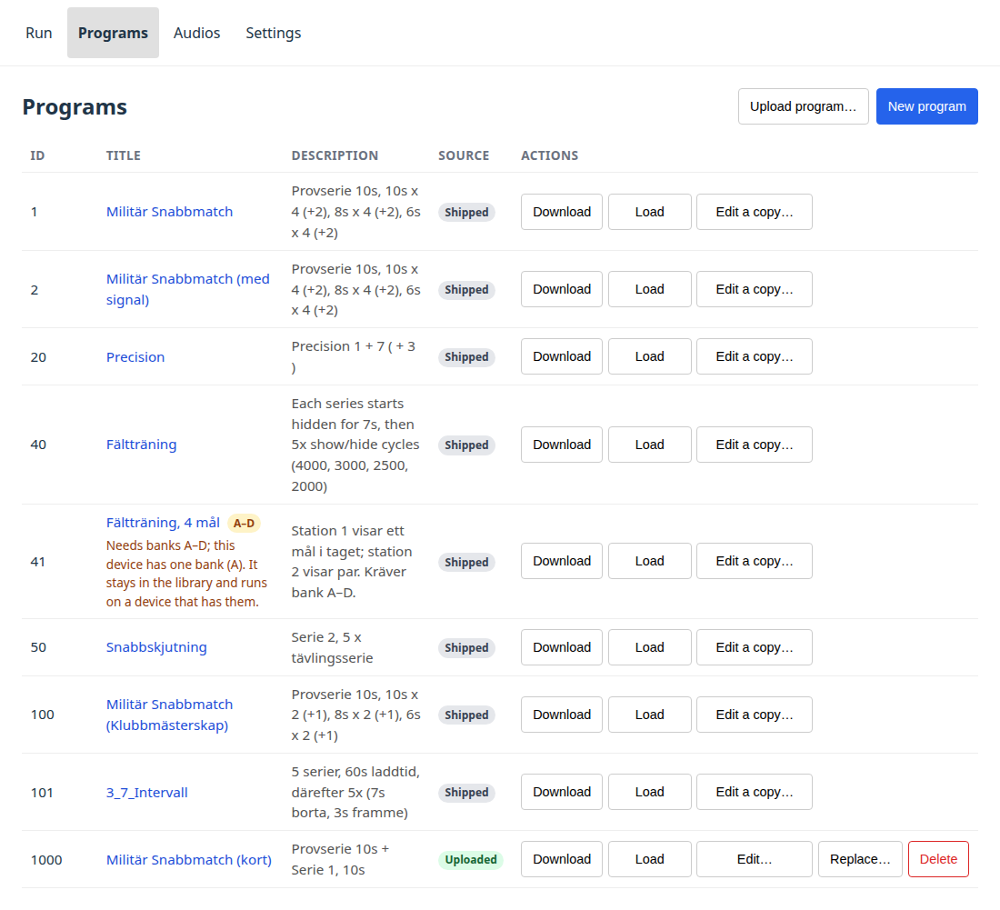
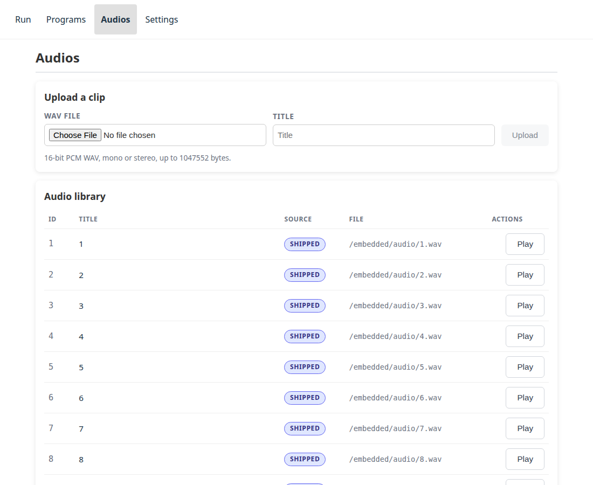

# Program och ljud

Allt enheten kör lagras på enheten: programmen, och de inlästa eldkommandon de
spelar upp. Båda hanteras från webbappen, och båda finns i två slag —
**medföljande** med firmwaren, och **uppladdade** i efterhand.

Skillnaden spelar roll eftersom medföljande innehåll inte kan ändras eller tas
bort från webbappen. Det är en del av firmware-avbilden, så en ny firmware ger
en ny uppsättning; inget som görs på skjutbanan kan ta bort det. Uppladdat
innehåll är ditt att lägga till, ersätta och ta bort.

## Program { #programs }

Varje rad är ett program. **Källa** säger medföljande eller uppladdat, och
åtgärderna följer av det: ett uppladdat program kan redigeras, ersättas och tas
bort, ett medföljande bara laddas ner eller kopieras.

- **Ladda** gör det till programmet som sidan Kör kommer att köra. Bara ett
  program är laddat åt gången, och raden visar vilket.
- **Ladda ner** sparar programmet som en `.json`-fil — sättet att få en kopia
  av ett medföljande program att utgå från.
- **Redigera en kopia…** på ett medföljande program öppnar redigeraren på en
  kopia, som laddas upp som ett nytt program och lämnar originalet orört. På
  ett uppladdat program ändrar **Redigera…** det på plats.
- **Ersätt…** skriver över ett uppladdat program från en fil.
- **Ta bort** tar bort ett uppladdat program. Ett medföljande vägrar med en
  förklaring i stället för att försvinna från listan.

### Id { #ids }

Id under 1000 är medföljande; uppladdningar numreras från 1000 och uppåt.
Enheten väljer id, inte filen — numret inuti ett uppladdat dokument ignoreras —
och den delar ut det lägsta lediga, så att ta bort 1001 och ladda upp igen ger
1001 i stället för att hoppa förbi det.

### Redigera { #editing }

**Nytt program** och **Redigera**-åtgärderna öppnar samma redigerare: serier
och händelser som ett formulär, den JSON enheten faktiskt kommer att ta emot på
en andra flik, och en skrivskyddad förhandsvisning av tidslinjen under båda.
Händelser har en varaktighet, om de visar eller döljer tavlorna, och eventuella
ljudklipp som ska spelas upp när de börjar.

Redigeraren kontrollerar dokumentet mot vad enheten accepterar innan den
skickar något, och säger vad som skulle ändras eller avvisas i stället för att
låta enheten svara med ett fel i efterhand.

## Ljud { #audio }

Du kan ladda upp en inspelning direkt från din telefon: **M4A, MP3, WAV**,
eller vad som helst annat som din webbläsare kan spela upp. Webbläsaren
konverterar den till enhetens komprimerade format innan den skickas, vilket tar
en liten stund, begränsar ett klipp till strax under en och en halv minut, och
lämnar plats för ungefär fyra gånger så många klipp som okomprimerad WAV skulle
göra. Allt som enheten inte kan spela upp avvisas vid uppladdningen i stället
för att tyst misslyckas mitt i en övning.

Klippen som *följer med* enheten är komprimerade, vilket är anledningen till
att de tar ungefär en fjärdedel av den plats de brukade ta och till att det
finns mer utrymme för dina än det fanns. Det gör ingen hörbar skillnad på
skjutbanan — högtalaren får samma fil hur som helst — och originalen finns i
projektets källkod, så inget går förlorat.

**Spela upp** skickar klippet till enhetens egen förstärkare — inte till
webbläsaren — så det är en kontroll av inkopplingen och högtalaren, inte av
filen.

### Vad som inte kan tas bort, och varför { #what-cannot-be-deleted-and-why }

Ett eldkommando som tyst uteblir mitt i en övning är ett säkerhetsproblem på
skjutbanan, så enheten vägrar en borttagning som skulle kunna orsaka ett
sådant. I den ordning den kontrollerar:

| Anledning | Upphör när |
|---|---|
| Klippet följer med firmwaren | aldrig |
| Det laddade programmet spelar upp det | ett annat program laddas, eller det nuvarande avlastas |
| En körning pågår | körningen pausas eller avslutas |
| Enheten spelar upp just det klippet just nu | klippet tar slut |

Lägg märke till den andra: att pausa räcker inte. **Pausa** behåller
körningens exakta position, så ett klipp som tas bort mellan två halvor av en
pausad körning skulle saknas när den återupptas. Avlasta programmet, eller
ladda ett annat.

## Få in ett program i den medföljande uppsättningen { #getting-a-program-into-the-shipped-set }

Uppladdade program finns på en enhet. De finns kvar efter uppdateringar, och
en [säkerhetskopia](settings.md#backup) flyttar dem till en annan enhet. Ett
program som ska finnas på varje enhet hör hemma i repot, där det följer med
nästa firmware.

Vägen är: **Ladda ner** programmet från sidan Program, och öppna sedan en pull
request som lägger till det under `resources/programs/files/` med filnamnet
`<id>.json` — ett id under 1000 som inte redan är upptaget. Detsamma gäller
ljudklipp under `resources/audios/`.

[Programredigeraren](https://malmo-skyttegille-pistolsektionen.github.io/revolve_now/editor/) gör båda halvorna åt dig — se
[Skriva ett eget program](writing-a-program.md).
