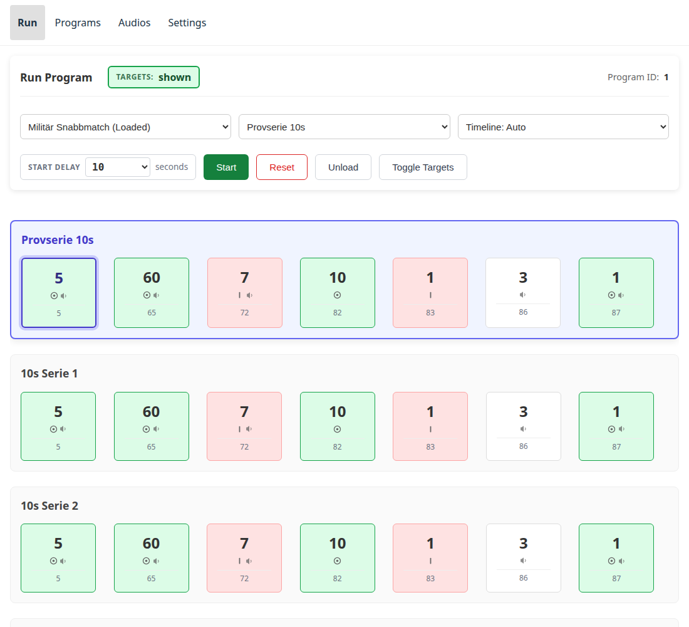
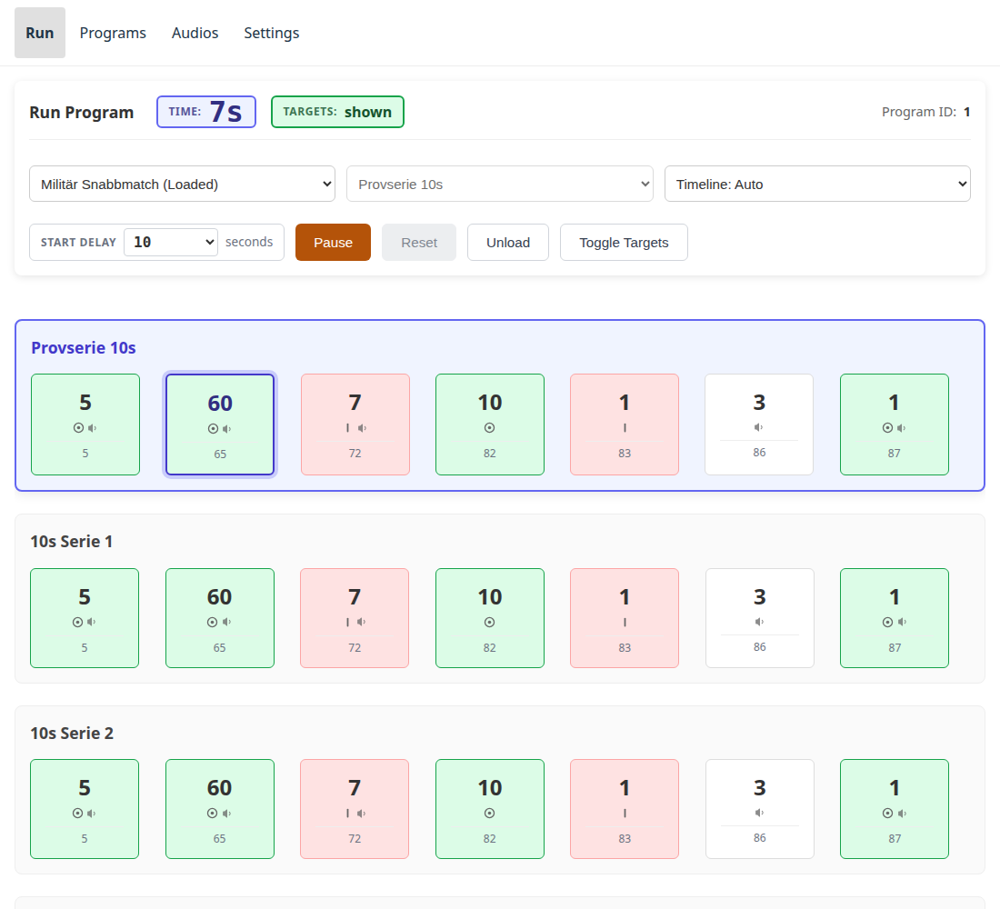

# Köra ett program

## Ladda { #loading }

Välj ett program i rullgardinsmenyn på Kör-sidan. Att välja ett **laddar** det
— det startar det inte. Enheten bekräftar vad den har laddat innan sidan låter
dig göra något med det; ett program som är valt men ännu inte bekräftat lämnar
Starta avstängd ett ögonblick.

Ett program är en följd av **serier** — en tävlings olika skjutserier, till
exempel — var och en med egna tavlor och händelser. Har programmet fler än en
väljer en andra rullgardinsmeny vilken serie som körs först; hoppa fram till en
senare när som helst (se [Hoppa över](#optional-series-and-skipping) nedan).

## Starta { #starting }

**Startfördröjning** anger hur många sekunder som räknas ner innan programmet
faktiskt startar — **Ingen fördröjning** startar det direkt. Värdet sparas i
den webbläsare du ställer in det i, så en annan telefon eller surfplatta på
samma skjutbana behåller sitt eget värde.

Med en fördröjning inställd öppnar Starta en nedräkning med egna knappar
**Starta nu** (hoppa över resten av väntan) och **Avbryt**. Nedräkningen
avbryts automatiskt om enhetens laddade program ändras under tiden — en annan
flik eller enhet på skjutbanan ändrade något — och ett meddelande förklarar
varför.

När körningen är igång:

- **Pausa** stoppar körningen och behåller dess exakta position, ned på
  millisekunden — en återupptagning utan fördröjning fortsätter därifrån, inte
  från seriens början.
- **Återställ** spolar tillbaka till början av den *aktuella* serien (serien
  förblir vald; bara positionen återställs). Bara tillgänglig under paus.
- **Avlasta** tömmer det laddade programmet helt. Erbjuds även mitt i en
  körning: enheten vägrar medan ett program körs och förklarar varför, så Pausa
  är vägen ut ur den vägran.
- **Vänd tavlorna** visar eller döljer tavlorna direkt, oberoende av något
  program — bra för att kontrollera att inkopplingen fungerar över huvud taget.

På en enhet med mer än en [tavelgrupp](hardware.md#target-banks) blir
`TAVLOR`-indikatorn högst upp på sidan en **remsa**: en cell per tavelgrupp,
med bokstäver från A och uppåt, grön för visad och röd för dold, och gruppens
namn under bokstaven på en skärm som är bred nog. En skjutbana som visar en
bana i taget läses alltså med en blick, och en tavelgrupp som inte rörde sig
syns i stället för att försvinna i ett medelvärde.

Kontrollerna följer med. I stället för en enda **Vänd tavlorna**-knapp finns en
**Tavlor**-grupp: ett tryck på en bokstavscell vänder **bara den tavelgruppen**,
och **Visa alla** / **Dölj alla** flyttar alla grupper tillsammans. En enhet
med en tavelgrupp — vilket de flesta har — behåller den enda indikatorn och den
enda knappen, oförändrade.

Tills enheten har sagt var tavlorna står visar indikatorn `-` i stället för att
gissa.

## Tidslinjen { #the-timeline }

Kör-sidan visar varje serie och händelse i det laddade programmet och följer
körningen live medan den spelas upp:

- Varje händelse visar sin varaktighet, om den visar eller döljer tavlorna och
  om den spelar upp ett eldkommando genom förstärkaren.
- Peka på (eller tryck på) en händelse för att se alla detaljer — inklusive
  vilka ljudklipp den spelar, med namn i stället för nummer.
- Den serie som körs rullas automatiskt fram i bild när körningen når den.

Tre visningslägen finns i rullgardinsmenyn bredvid programväljaren: **Auto**
väljer den layout som passar det laddade programmet, **Händelsebaserad** ritar
händelserna som en sekvens med fast bredd, och **Tidsskalad** ritar dem i
proportion till deras faktiska varaktighet, med en rörlig markör som visar
exakt var körningen befinner sig just nu.

## Valfria serier och att hoppa över { #optional-series-and-skipping }

Vissa serier är märkta som **valfria** — en uppvärmningsserie, till exempel —
och bär ett märke på tidslinjen som säger det. Medan körningen står vid en
valfri serie (inte medan den spelas upp) går en **Hoppa över**-knapp på den
serien direkt vidare till nästa utan att köra den.

Rullgardinsmenyn för serier når varje serie direkt, när som helst programmet
inte körs, om körningen behöver hoppa längre än ett steg — men att hoppa över
mitt i en körning erbjuds inte: **Pausa** är sättet att avbryta en pågående
serie i förtid.
