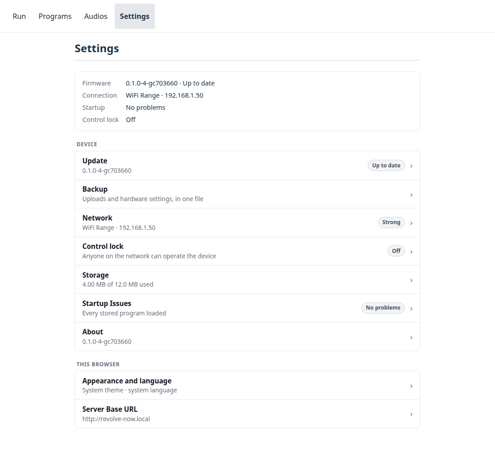

# Settings

The Settings tab holds two different kinds of thing, and it is worth knowing
which is which before changing anything:

- **Browser settings** live in the browser you are using. Another phone or
  tablet at the same range keeps its own, and clearing site data resets them.
- **Device settings and readouts** come from the board itself, and are the
  same for everyone looking at it.

The page opens with a short status: which firmware, how the device is
connected, whether it started cleanly and whether the control lock is on.
Below it, each topic is one row with a line saying how it stands. Tap a row to
open it; opening another closes the first. A row that needs a look, such as a
newer release or a startup problem, says so in its badge.

| Row | Kind | What it is |
|---|---|---|
| Update | device | Install a release from GitHub, or upload an OTA file |
| Backup | device | Save what has been put on the device to a file, and put it back |
| Network | device | WiFi: which network it is on and how good the link is. Ethernet: the cable link and its address |
| Control lock | device | Whether control is open to everyone or needs a login |
| Storage | device | How much room the flash partitions have |
| Startup Issues | device | What the device could not read when it booted |
| About | device | What firmware and web app this is, and exactly which build |
| Appearance and language | browser | Light or dark, English or Swedish, or whatever this phone or computer is set to |
| Server Base URL | browser | Which device this browser talks to, and the address the device reports |

Nothing on this page can stop the device working. The settings that can —
which network it joins, which pins it drives, and the crash dump download —
are on [Expert mode](expert-mode.md), behind a button press on the board
itself. A [restore](#restoring) can bring hardware settings back too, and only
behind that same button press.

**One line can appear at the top:** *Configuration saved but not applied;
restart from Expert mode.* It means somebody changed a setting on that page and
the device is still running what it started with. The change is not lost and
nothing is broken — it needs
[**Restart to apply**](expert-mode.md#restart-to-apply), which is on that page
whether or not the five-minute window is still open. It is here so that the
next person to pick the device up finds out, rather than being surprised by it
at the next power cycle.

**Target banks are configured there too.** How many lines this device drives,
what each is called and which pin it is on is Expert-mode work —
[the bank table](expert-mode.md#the-target-banks) — because a wrong pin is one
of the settings whose way back is a USB cable. What you see on the Run page —
the lettered strip and the per-bank buttons — follows from it, and needs
nothing set here.

## Server Base URL

Normally there is nothing to do here — the app talks to whatever served it.
It matters when the app is being run from somewhere other than the device
(during development, or from a copy on a laptop) and needs pointing at a board.

## Address

What the device reports as its own address. If it says the device has no
address, it is serving its own access point instead of being on a network —
see [the setup portal](connecting.md#the-setup-portal).

## Control lock

Two states:

- **Full public access** — anyone who can reach the page can control the
  device. This is the default, and it is usually what a range wants: no
  password to pass around while people are shooting.
- **View only** — the page still shows what is happening, but starting,
  stopping, uploading and deleting all require a login.

Turning it on asks for a password to set. From then on this browser holds a
token; **Login** on another browser asks for that password again.

The password protects against the accidental rather than the determined: the
device is on the range's own network, and the traffic is plain HTTP.

## Startup Issues

What the device could not read when it booted: a program file that does not
parse, a clip whose header is not a WAV it can play. The list is bounded and
drops the oldest, so a device with many bad files shows the most recent ones.

An empty list is the normal state and says the boot scan read everything.

## Storage

Partition sizes. Note the note: **size only — the device cannot report what is
used here** for some partitions, so a figure being absent is not a fault.

The one to look at is **`userdata`**. It holds what has been uploaded to the
device — programs and audio clips — and nothing else. Everything that ships
*with* the device is inside the firmware itself, so the shipped set growing can
no longer eat the room for yours, and updating the device cannot touch what you
put on it.

`ota_0` and `ota_1` are the two copies of the firmware. One is running and the
other is where an update is written, which is what lets a bad update be undone.
Seeing one of them nearly empty is normal on a device that has never been
updated.

## Backup

**Download backup** saves one file with everything that has been uploaded to
the device — your programs and audio clips — and its hardware settings: the
pins, the target banks, the name. What ships *with* the device is not in it;
that comes back with the firmware.

**The WiFi password is never in a backup**, so the file is safe to pass on or
keep in a shared folder.

Take one:

- **Before updating the firmware**, and above all before going back to an older
  version, which may not read what a newer one stored.
- **Before a factory reset**, which empties the device's settings.
- **To set up a second board** like the first.

Keep it somewhere other than the device.

### Restoring

**Restore from file…** adds what the backup holds to this device. **Nothing on
the device is deleted**, and anything already there — the same program, or a
clip with the same title and sound — is skipped. Restoring the same file twice
changes nothing the second time. Afterwards the page lists what was added,
what was already there, and anything the device refused, with the reason.

Two choices first:

- **Hardware settings** (on by default). They are restored only while the
  [configuration window](expert-mode.md) is open — press BOOT three times
  first — because they are the settings whose way back can be a USB cable.
  With the window shut they are skipped and the rest is restored anyway. Like
  any hardware change, they take effect when the device restarts.
- **Device name** (off by default): the hostname and display name from the
  backup. Turn it on when the backup is this board's own, or a board it
  replaces. Leave it off when setting up a second board, or two boards will
  answer to the same name.

**Restore the file as you downloaded it.** A backup that has been unpacked and
zipped again is refused, because it is no longer laid out the way the device
wrote it.

A backup from an older firmware restores onto a newer one. Anything the
running firmware cannot read is refused on its own and listed; the rest is
restored.

## Network

How the device is connected, in two halves: WiFi, and Ethernet on a firmware
that supports an [Ethernet module](hardware.md#ethernet). A device on both has
two addresses, and either reaches it. Switching either off is in
[Expert mode](expert-mode.md#hardware).

### WiFi { #wifi }

Which network the device joined, how strong the signal is, the address it is
reachable at, and the MAC address a router lists it under. All of it is a
readout — nothing here changes anything.

**Which network matters, not just that there is one.** A device remembers the
network it was set up on *and* the one its firmware was built for, and joins
whichever it can see. A board that has been to two places may be on either, and
this is where you find out which.

**Signal** is shown as bars and as a number in dBm. The number is negative and
closer to zero is stronger — around −50 is excellent, −70 is workable, and
below about −80 is where a device starts dropping off the network. It is the
figure to watch while moving a board around looking for somewhere to mount it.

If it says **no network has been saved**, nobody has set this device up here.
It is running on whatever network its firmware was built for, which cannot be
read back or changed without rebuilding it — so if it is working, it is working
by luck of being in the right building.

To *change* the network, see [Expert mode](expert-mode.md#wifi). It is a
once-per-site decision behind the button press on the board, which is why it is
not on this page.

### Ethernet { #ethernet }

**Link** says whether a cable is in and something answers at the other end,
and at what speed; **Address** is the one the router gave it over the cable.
Instead of those it may say Ethernet is **switched off**, or that **no module
was found** when the device started — it looks only then, so a module fitted
later needs a restart.

If WiFi is switched off, its half says so. The device still uses WiFi when the
cable gives it no address, so it cannot end up unreachable.

## Update

Installing an update **restarts the device**, so do it between runs, not
during one; the device refuses while a program is running. It is written to
the copy of the firmware that is not running, so an update that will not start
rolls back by itself. The web app and the shipped programs and audio update
with it; programs and audio you uploaded are kept.

**From GitHub.** Opening Settings checks GitHub for releases; *Check again*
asks once more. Pick a version to read its release notes. Installing is two
steps: *Download* saves the release's `revolve_now-<version>-ota.bin` on this
phone or computer, and *Install the downloaded file* sends it to the device.
The page first checks the file against the checksum GitHub published for that
release, so a wrong or damaged file is refused before the device sees it.

Only this phone or computer needs internet; the device never contacts GitHub.
If the page says it **can't reach GitHub**, the problem is here, not on the
device: a phone joined to a range WiFi without internet may need to be told to
stay on that network, or the file can be fetched elsewhere and uploaded below.

**Going back to an older version** is possible but asks first. Newer versions
can change how settings and uploaded programs are stored, and an older version
may not read them: settings can be ignored or reset, programs can fail to load,
and in the worst case the device needs a cable and a factory flash to recover.

**From a file.** Choose a `revolve_now-<version>-ota.bin` you already have with
*Upload OTA file*. This needs no internet anywhere. The `factory.bin` on a
release page is for a cable, not for this.

## About

**App** is the version of the page you are looking at. **Device** is the
firmware's. One version number covers firmware, web app and shipped content,
and the web app is part of the firmware image itself — so a page served *by*
the device always matches it, however the device was updated.

That includes an update sent over the network, which used to be the awkward
case: it replaced the firmware and left the web app behind, so a device could
serve a page older than the firmware running it until somebody flashed it over
USB. That cannot happen any more, and the shipped programs and audio are part
of the same image, so they are updated with it.

So a mismatch now means one thing: **this page did not come from that device.**
A development build, or a copy served from a laptop, pointed at a board built
from a different commit.

A hard reload will not help. The browser is showing the version it was given;
the two really are different.

**Modified build** beside the device version means the firmware was built from
a working copy with uncommitted changes. On a board flashed from a release that
should not appear; on a board somebody has been developing against, it is
normal.

### Build details

**Build details** opens a table naming exactly which build this is: the commit,
when it was built, which branch it came from, the ESP-IDF version, and
fingerprints of the web app and audio it was built with.

None of it is worth reading day to day. It exists for one situation: **a board
that has come back from a range day behaving oddly.** "Which firmware is this"
is answerable from the version alone; "which commit, built where, with which
audio set" is not, and those are the questions that get a fault diagnosed.

**Copy** puts the whole block on the clipboard, ready to paste into a bug
report — which is the only thing it is for. If your browser refuses (some do on
a plain `http://` address, which is what the device serves), the text appears
below instead so you can select it by hand.

## Troubleshooting

The crash dump download has moved to [Expert mode](expert-mode.md#troubleshooting).
It is behind the device's BOOT button because a crash dump can contain the WiFi
password, and everything behind that button is now on one page rather than
appearing and disappearing on this one.

[Sending a fault report](troubleshooting.md#sending-a-fault-report) has the
steps and what it means for who you send it to.
