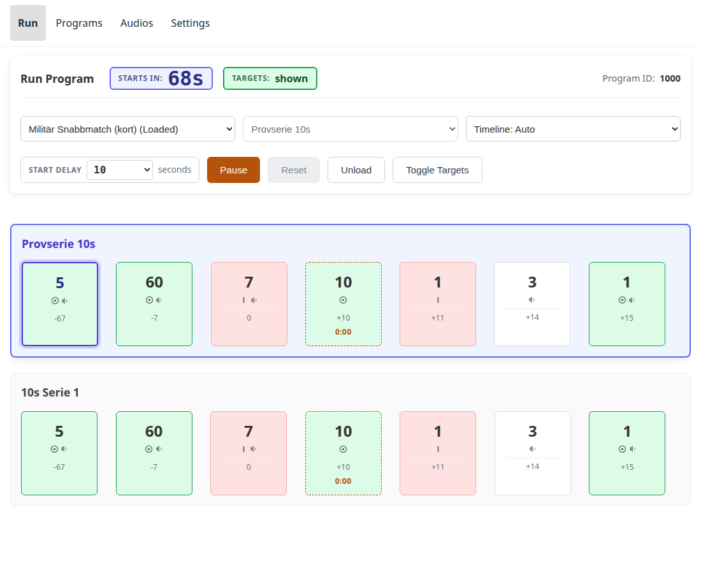
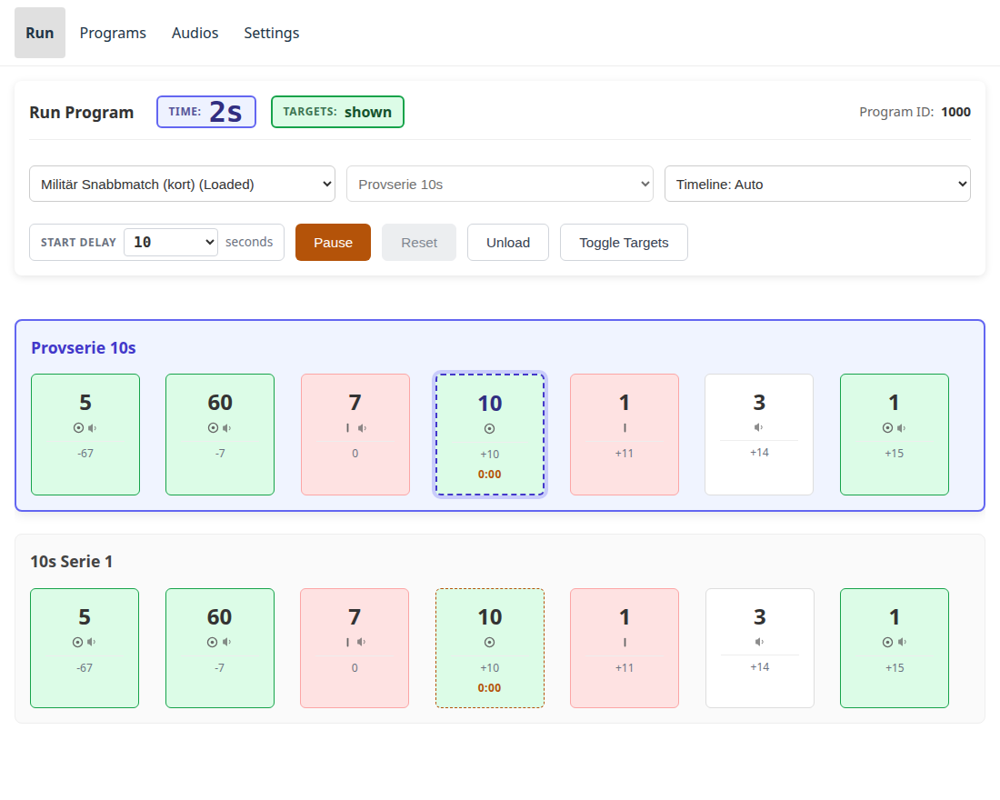

# Skriva ett eget program

Det här bygger ett riktigt program från grunden: **Militär Snabbmatch**,
nedkortad till sin provserie och den första skjutserien på 10 sekunder. Det är
kort nog att skriva in och långt nog att använda varje del av redigeraren som
spelar roll.

## Vad ett program består av { #what-a-program-is-made-of }

Ett **program** är en lista med **serier** — en tävlings separata skjutserier.
Enheten kör en serie och stannar sedan vid början av nästa, så att någon kan
klistra eller markera däremellan.

En **serie** är en lista med **händelser**. En händelse är: vänta så här länge,
och på vägen in, vänd eventuellt tavlorna och spela upp något ljud. Det är allt.
Allt ett program gör är ordningen på och längden av dess händelser.

Tre saker att veta innan du skriver något:

- **Varaktigheter anges i millisekunder.** `10000` är tio sekunder.
- **Kommandot är valfritt.** *Visa* vänder tavlorna fram, *dölj* vänder dem
  bort, och att lämna det på *ingen ändring* håller dem där den förra
  händelsen lämnade dem.
- **Flera klipp på en händelse spelas upp efter varandra**, i den ordning de
  står. De köas när händelsen börjar, och när *nästa* händelse börjar ersätts
  allt som fortfarande ligger i kön — så en rad klipp som är längre än sin egen
  händelse klipps av. Gör händelsen minst lika lång som talet den bär.

## Programmet vi bygger { #the-program-we-are-building }

Två serier, sju händelser var, 87 sekunder styck.

| # | Varaktighet | Tavlor | Ljud | Vad som händer |
|---|---|---|---|---|
| 1 | 5 000 | visa | *Provserie* · *1* · *10 sekunder* | Serien annonseras |
| 2 | 60 000 | visa | *Ladda!* | En minut att ladda, tavlorna framvända |
| 3 | 7 000 | dölj | *Färdiga!* | Tavlorna vänds bort; skyttarna är klara |
| 4 | 10 000 | visa | — | **De tio sekundernas skjutning** |
| 5 | 1 000 | dölj | — | Tavlorna vänds bort; serien är slut |
| 6 | 3 000 | *ingen ändring* | *Eld upphör!* | Eld upphör |
| 7 | 1 000 | visa | *Patron ur…* · *Några funktioneringsfel?* · *Visitation!* | Patron ur och visitation |

Den andra serien är identisk utom händelse 1, som i stället annonserar
*Serie 1, 10 sekunder* — ett klipp i stället för tre.

Lägg märke till händelse 6: inget kommando alls. Tavlorna doldes av händelse 5
och förblir dolda; det finns inget att vända, bara något att säga.

## Skriva in det { #typing-it-in }

Öppna **Program → Nytt program**.

1. **Titel** — `Militär Snabbmatch (kort)`. **Beskrivning** —
   `Provserie 10s + Serie 1, 10s`. Beskrivningen är det programlistan visar, så
   låt den säga vad programmet *är*, inte vad det heter.
2. Döp den första serien till `Provserie 10s`. Lämna **Valfri** omarkerad.
3. För varje rad i tabellen: ange varaktigheten, välj tavelalternativet och
   lägg till klippen. Rutan **Sök klipp** matchar mot klippets titel, så att
   skriva `Ladda` hittar *Ladda!* utan att du behöver veta att det är id 26.
4. **Lägg till serie** för `10s Serie 1` och gör om det. Kopieringsknappen på
   en serie duplicerar den, vilket går fortare — byt sedan det enda
   annonseringsklippet.

Tidslinjen **Förhandsvisning** längst ner i redigeraren ritar upp serien medan
du bygger. Det är den snabbaste kontrollen av att formen stämmer: ett långt
block för laddning, ett kort mellanrum, sedan skjutningens korta stöt.

## Att få klockan att betyda något { #making-the-clock-mean-something }

Kör programmet som det är och timern räknar från seriens början — så när
tavlorna visas för de tio sekunder som faktiskt spelar roll står klockan redan
på 72 sekunder. Den siffran är förspelets längd, och den intresserar ingen.

Det en skytt vill ha är en klocka som står på noll när tavlorna visas.

Det är vad **`timer_start_index`** gör: det anger vilken händelse klockan
startar på. Allt före den händelsen räknar *ner* till den; från den händelsen
räknar klockan *upp*. Här är skjutningen händelse 4, vilket är index **3**
räknat från noll.

Det finns ännu ingen kontroll för detta i redigerarens formulär, så byt till
fliken **JSON** och lägg till en rad i varje serie, bredvid `"name"`:

```json
"timer_start_index": 3,
```

Spara, ladda programmet och starta det. Genom annonseringen och
laddningsminuten räknar klockan ner:



och i det ögonblick tavlorna visas står den på noll och räknar upp genom de tio
sekunderna:



Samma körning, samma händelser — bara frågan klockan svarar på har ändrats.

Två regler som enheten upprätthåller, i stället för att gissa sig runt dem:

- Indexet måste ange en händelse som serien faktiskt har. `3` i en serie med
  tre händelser avvisas vid uppladdning, inte tyst begränsat — ett index förbi
  slutet betyder att författaren menade en händelse som inte finns.
- Att utelämna det är samma sak som `0`, vilket är vad varje program menade
  innan det här fanns: klockan startar med serien.

## Tavelgrupper: vända en tavla och inte de andra { #banks-turning-one-target-and-not-the-others }

En enhet med mer än en **tavelgrupp** driver varje grupp av tavlor på en egen
ledning. Tavelgrupperna namnges med bokstav — `A`, `B`, `C` … — och en händelse
adresserar dem som en grundinställning plus undantag:

```json
{ "duration": 4000, "command": "hide", "banks": { "B": "show" } }
```

`command` gäller för varje tavelgrupp händelsen **inte** namnger, `banks`
ställer dem den namnger, och en grupp som ingen av dem namnger lämnas där den
är. Så den här händelsen vänder B fram och alla andra grupper bort, i en
händelse i stället för två.

Det är därför ett befintligt program inte behöver ändras alls: utan någon
`banks`-nyckel gäller `command` för allt, vilket är vad "visa tavlorna" alltid
har betytt.

Det finns högst åtta tavelgrupper, `A` till `H`.

Redigerarens stegväljare **Tavelgrupper som programmet använder** avgör hur många
bokstäver händelseraderna erbjuder; den lagras inte i filen.

Ett program som namnger tavelgrupp `D` behöver en enhet med grupperna A–D.
Inget hindrar dig från att lägga det på en enhet som har färre: det laddas upp,
det listas och det **laddas** — att ladda är så ett program når körningens
tidslinje för att läsas igenom innan någon är framför skjutlinjen. Det enheten
vägrar är **starten**, eftersom att rikta `D` mot någon annan tavla skulle
flytta stål ingen bett om att flytta. Program-sidan märker raden med
tavelgrupperna det behöver, och Kör-sidan säger varför Starta inte går att
använda när programmet väl är laddat.

Det medföljande [`41.json`](https://github.com/Malmo-Skyttegille-Pistolsektionen/revolve_now/blob/main/resources/programs/files/41.json)
("Fältträning, 4 mål") är ett genomarbetat exempel: en tavla i taget, sedan
parvis.

## Hela filen { #the-whole-file }

Inget ovan kräver att du skriver in det för hand — men om du hellre utgår från
det färdiga, så är det här:
[militar-snabbmatch-kort.json](snippets/militar-snabbmatch-kort.json).
Spara den och använd **Ladda upp program…** på Program-sidan.

```json
--8<-- "snippets/militar-snabbmatch-kort.json"
```

`id` ignoreras vid uppladdning: enheten tilldelar nästa lediga id från 1000 och
uppåt, och talar om vilket den valde.

## Var det finns efter det { #where-it-lives-after-that }

Ett uppladdat program finns på **en enhet**. Det finns kvar efter
uppdateringar, och en [säkerhetskopia](settings.md#backup) flyttar det till en
annan enhet. För att få det på varje enhet måste det in i repot — se
[få in ett program i den medföljande uppsättningen](programs-and-audio.md#getting-a-program-into-the-shipped-set).

[Programredigeraren](https://malmo-skyttegille-pistolsektionen.github.io/revolve_now/editor/) gör båda halvorna av det åt dig: öppna
programmet i den, tryck på **Fortsätt**, så erbjuder den filen att ladda ner
och en förifylld pull request mot det här repot.

### Öppna ett program från ett repo { #opening-a-program-from-a-repository }

**Öppna från ett repo** är redan ifyllt med det här projektet: tryck på **Bläddra
bland program** så visas den medföljande uppsättningen, listad efter titel i
stället för filnamn, så att du kan skilja *Provserie* från *Fältträning* utan
att öppna båda.

Två fält är värda att känna till:

- **Ref** — en gren, en tagg eller en commit. Lämna det tomt för det senaste;
  sätt det till en utgåvetagg för att öppna ett program exakt som den utgåvan
  levererade det.
- **Sökväg** — var programmen ligger i det repot. Standardvärdet är där de
  ligger i *vårt*; en annan klubbs repo kan vara upplagt annorlunda, och en fel
  sökväg ser ut som ett tomt repo snarare än ett misstag.

Att ändra **Ägare** och **Repo** riktar den mot någon annans program, vilket är
det som gör att ett program skrivet på en annan klubb går att öppna här.
